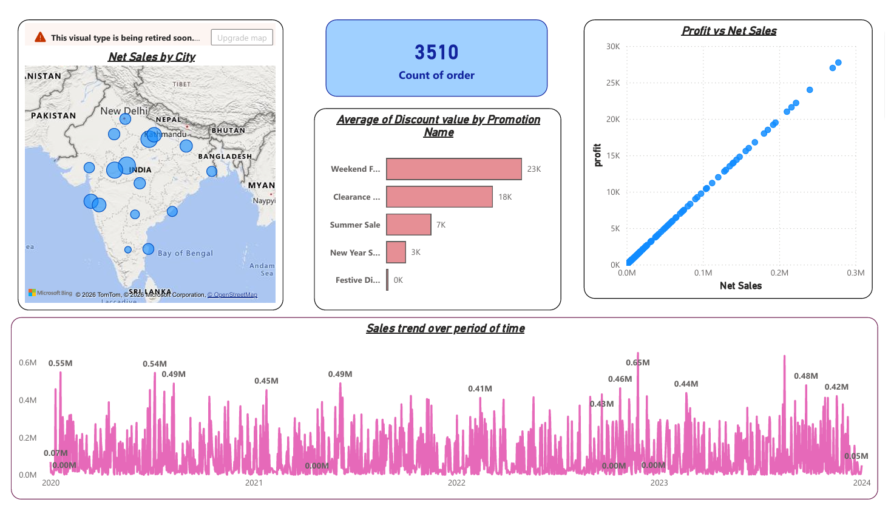
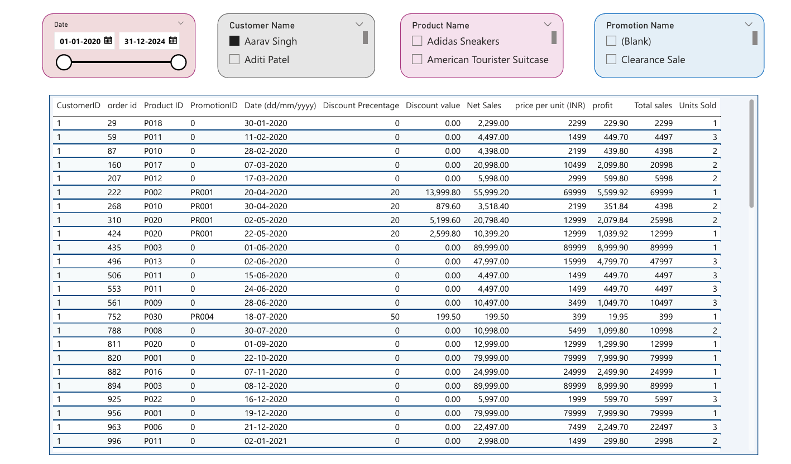

# 📊 Sales Analysis Dashboard

An interactive **Power BI Sales Analysis Dashboard** that provides insights into sales performance, profitability, product trends, customer behavior, and promotional impact through dynamic visualizations.

## 🚀 Features

- 📈 Sales Trend Analysis
- 💰 Total Sales, Net Sales & Profit KPIs
- 🏆 Top & Bottom Performing Products
- 👥 Customer-wise Sales Analysis
- 🎯 Promotion & Discount Analysis
- 🗺️ City-wise Sales Distribution
- 📅 Interactive Filters (Date, Customer, Product, Promotion)

## 🛠️ Tools Used

- Power BI
- Power Query
- DAX
- Excel

## 📷 Dashboard Preview

### Sales Overview

### KPI Dashboard

## 📌 Key Insights

- Identified top and bottom performing products.
- Analyzed sales and profit trends over time.
- Evaluated promotional campaign effectiveness.
- Tracked customer and city-wise sales performance.
